# Diagram Design Fly

**Editorial diagrams your designer won't hate.**

English · [中文](README.zh-CN.md) · [Live gallery ↗](https://huangzhuxing.github.io/diagram-design-fly/)

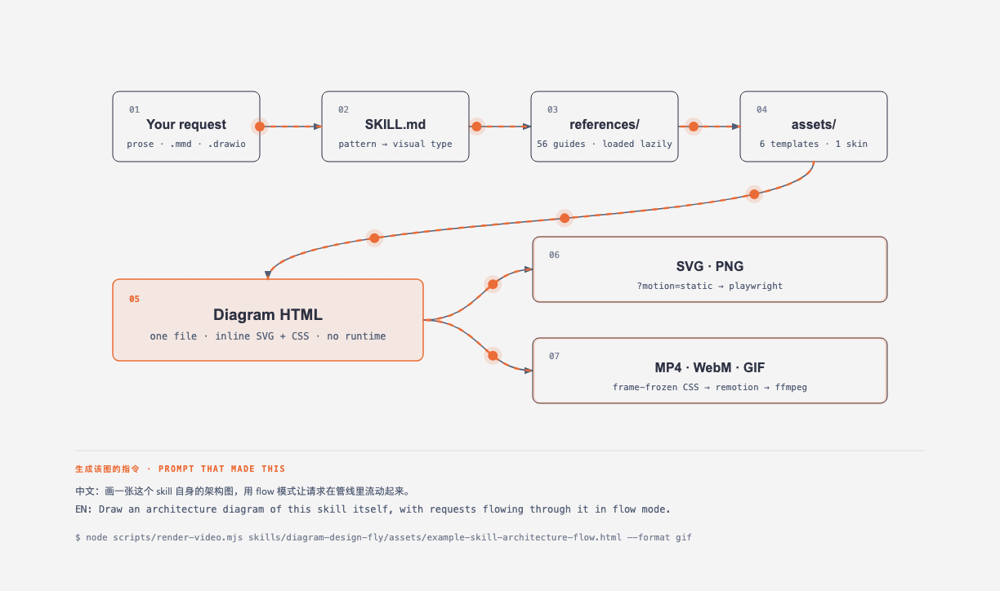

*That diagram is this skill's own architecture, drawn by the skill, animated by `flow` mode, and rendered to GIF by the export path it documents. Nothing in it was hand-animated.* ([source](skills/diagram-design-fly/assets/example-skill-architecture-flow.html) · [MP4](docs/motion/skill-architecture.mp4))

<details>
<summary><b>Try it — the prompt that made this / 生成这张图的提示词</b></summary>

```text
中文：画一张这个 skill 自身的架构图，用 flow 模式让请求在管线里流动起来。
EN:   Draw an architecture diagram of this skill itself, with requests flowing
      through it in flow mode.
```
```bash
node scripts/render-video.mjs skills/diagram-design-fly/assets/example-skill-architecture-flow.html --format gif
```
</details>

**New in this fork — `flow` mode.** Pipelines that actually flow: material moving through conduits, tokens crossing edges, arrival pulses on the nodes that receive them. Pure CSS, no JavaScript, and a complete static frame underneath. Plus one command to render any flow diagram to MP4, WebM, or GIF.

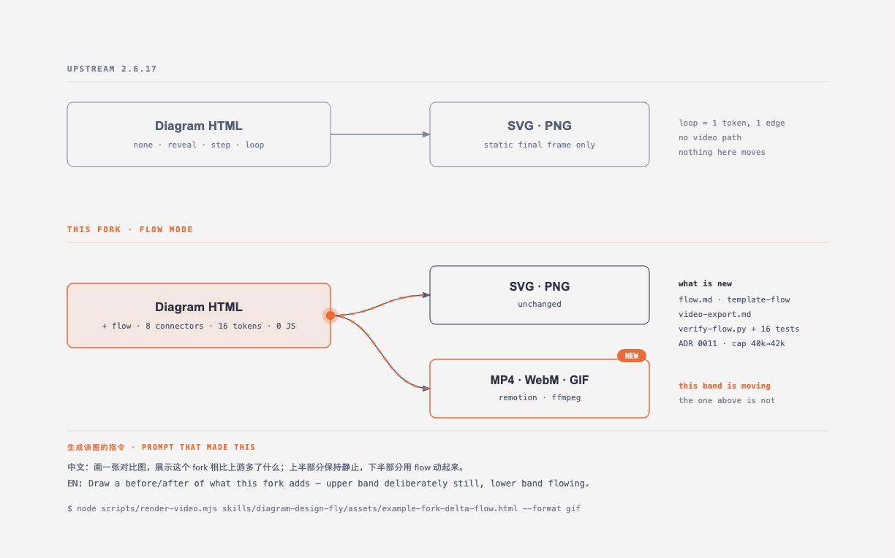

*Both bands were drawn by the same skill. The upper one carries no flow layer — the contrast is the changelog.* ([source](skills/diagram-design-fly/assets/example-fork-delta-flow.html))

<details>
<summary><b>Try it / 生成这张图的提示词</b></summary>

```text
中文：画一张对比图，展示这个 fork 相比上游多了什么；上半部分保持静止，
      下半部分用 flow 动起来。
EN:   Draw a before/after of what this fork adds — upper band deliberately
      still, lower band flowing.
```
```bash
node scripts/render-video.mjs skills/diagram-design-fly/assets/example-fork-delta-flow.html --format gif
```
</details>

---

## One prompt, one page

This came out of a real repository — a Go + React SRE console — with the skill installed and nothing else set up. The whole prompt was:

**The whole usage, start to finish:**

1. Invoke `diagram-design-fly` in Codex or Claude Code.
2. Type one sentence. You do not have to ask for motion — an ordered subject animates by default.
3. The first time in a new project it asks about brand styling; answer `e` for the default.

```text
将当前的项目架构详细描述出来
Describe the architecture of this project in detail.
```


No mention of motion, no diagram type, no layout, no colours.

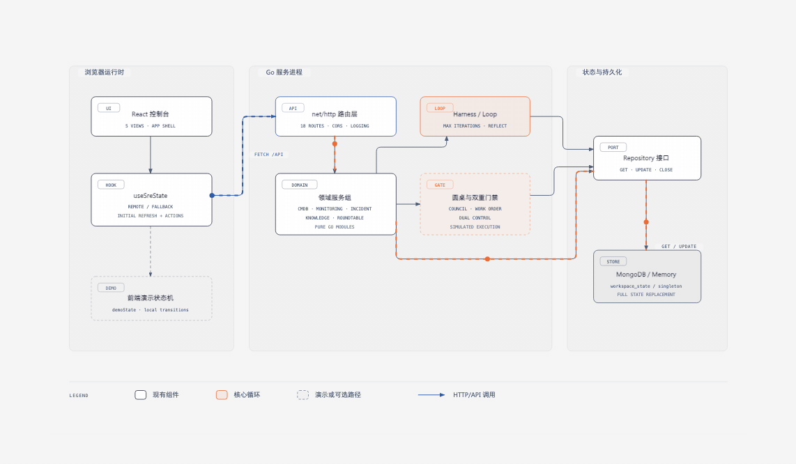

It read the codebase and returned a three-diagram page: this runtime overview, a Go module dependency graph, and the roundtable change state machine — plus interface/data boundaries and deployment layers. `flow` mode was chosen on its own, because the subject carries an order.

The part worth noticing is what it **left out**. It merged five frontend views and five domain services into single nodes to stay inside the density budget, and it deliberately did not draw the real connectors, IAM approval, command executor, durable task queue, or graph/vector database — because those are planned, not built. The dashed boxes and the legend mark simulated paths as simulated. A diagram that quietly promotes a roadmap into an architecture is worse than no diagram.

The page passes `verify-flow`, `verify-motion`, `lint-render`, and `lint-contrast`. `lint-skin` reports three findings, all the same rule: its accessible-name check assumes one SVG per file, and this page has three, so it keeps three correct and distinct `<title>` / `<desc>` ID sets. That is the linter's assumption not fitting a multi-diagram page, not a defect in the output.

Source and render command:

```bash
node scripts/render-video.mjs docs/examples/opspilot-current-architecture.html --format gif
```

[](docs/screenshots/architecture.png)

[](docs/screenshots/loop.png)

*New in 2.0 — the Loop: flywheels with a shared-memory hub. The dashed lines are the write-backs.*

*New in 2.3: semantic system patterns and optional accessible motion, while static output stays the default.*

*New in 2.5.10: ten more layout grammars — Sankey, fishbone, Wardley map, kanban, user journey, deployment, dependency graph, UML class, story map, and database schema.*

39 editorial diagram types for Claude Code, Codex, Factory Droid, Pi, and Agent Skills-compatible hosts. Self-contained HTML + SVG. No shadows. No Mermaid slop. Semantic patterns describe behavior separately from layout, so a queue, policy trace, or trust boundary can use the nearest existing type without expanding the type count. Static HTML remains the default; optional motion is available for ordered explanations, and `flow` mode for continuous movement. The skill also redraws draw.io or Mermaid sources at a chosen format, size, and detail level, and renders any flow diagram to MP4, WebM, or GIF.

No Figma. No generic rounded boxes. No 30-minute color-picking sessions.

---

## Where this came from

This is a fork of [**diagram-design**](https://github.com/cathrynlavery/diagram-design) by
[Cathryn Lavery](https://github.com/cathrynlavery) — 39 editorial diagram types, the
design system, the semantic patterns, and the verification harness are all hers. In her words:

> Every time I needed a diagram — an architecture sketch, a flowchart, a pyramid of what
> matters most — I'd ask Claude and get back a generic rounded-box thing that looked nothing
> like the rest of the site. I'd either fight with Figma for 30 minutes or just skip the diagram.

> *The highest-quality move is usually deletion.* Every node earns its place. The accent colour
> is reserved for the 1–2 things the reader should look at first. Target density: 4/10.

**What this fork adds** is `flow` mode — continuous movement for diagrams whose subject is
throughput — and a video export path that renders any flow diagram to MP4, WebM, or GIF.
Everything else is upstream's, unchanged. If you do not need motion, use
[the original](https://github.com/cathrynlavery/diagram-design).

---

## What it makes

**Any of them can move.**

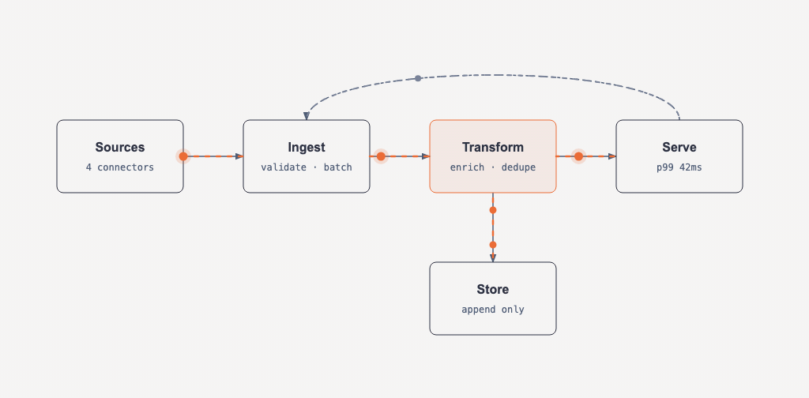

`flow` is a mode, not a 40th type. The same architecture, data-flow, loop, or swimlane diagram gains conduits and travelling tokens without becoming a different diagram — and drops back to the complete static frame below for print, reduced motion, and PNG export.

**Which ones it suits is not about the type — it is about whether the figure carries an order the reader is meant to travel.** Eighteen of the 39 do: pipelines, lifecycles, cycles, plans across time, work crossing columns, a quantity splitting downstream. For those, flow shows the direction and [stage numbers](#optional-stage-numbers) show where to start, and together they answer *what happens, and in what order* without needing a controller.

| | |
|---|---|
| **Ordered** — flow, numbers on | `architecture` `data-flow` `deployment` `dp-integration` `flowchart` `gantt` `high-level` `journey` `kanban` `loop` `medallion` `process` `sankey` `sequence` `state` `story-map` `swimlane` `timeline` |
| **Directional, not stepped** — flow sometimes, numbers rarely | `dependency` `fishbone` `it-state` `layers` `nested` `org-chart` `pyramid` `tree` `wardley` |
| **Unordered** — no flow | `bar` `db-schema` `er` `line` `polar` `quadrant` `radar` `scatter` `treemap` `uml-class` `venn` `dp-security-matrix` |

Nothing moves through an ER diagram and a bar chart's categories have no order to travel, so motion there is decoration — which the philosophy already rules out.

**Ordered subjects animate by default in this fork — you do not have to ask.** Upstream ships static and treats motion as an opt-in; here, if the figure carries an order, the skill builds it in `flow` with stage numbers on. That is safe because of the contract: a flow diagram *is* a complete static diagram with a decorative layer over it, and print, reduced motion, `?motion=static`, and PNG export all resolve to the same frame a static build would have produced. Defaulting to flow adds a layer; it never removes one. Unordered types stay static, and a type's own verifier still outranks the table — see the Sankey case in [`flow.md`](skills/diagram-design-fly/references/flow.md).

Video export stays manual, the same rule PNG and SVG follow: the skill tells you the one-line command, it does not run it.

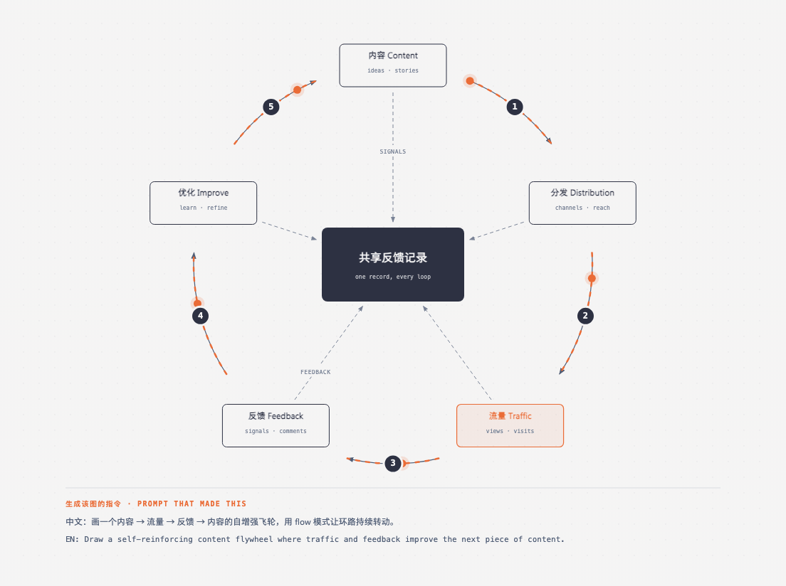

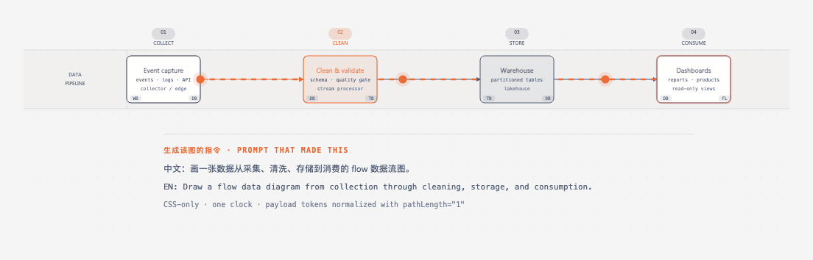

**Those last two were not written by hand.** They were generated by Codex (`gpt-5.6-luna`) from a one-paragraph Chinese prompt, with this repo's skill installed and nothing else — no code in the prompt. Codex routed from `SKILL.md` to `flow.md` on its own, and iterated against `verify-flow.py` until it passed. The exercise found two real defects, both since fixed: the verifier hardcoded a `@keyframes` name (which pushed the agent off the safer slug-prefixed form), and nothing checked that a conduit was long enough to watch anything travel along — the first draft laid its stages 12px apart and passed every other check while the motion was invisible.

**All 17 ordered types below are animated** — every thumbnail in that first list is a live `flow` diagram with stage numbers, generated by Codex against the routing table in `flow.md`. The unordered types stay static, because motion there would be decoration.

Twelve flow examples ship in the gallery (tabs 54–65): [skill architecture](skills/diagram-design-fly/assets/example-skill-architecture-flow.html) · [fork delta](skills/diagram-design-fly/assets/example-fork-delta-flow.html) · [flow mechanism](skills/diagram-design-fly/assets/example-flow-mechanism-flow.html) · [getting started](skills/diagram-design-fly/assets/example-getting-started-flow.html) · [data flow](skills/diagram-design-fly/assets/example-data-flow-flow.html) · [loop](skills/diagram-design-fly/assets/example-loop-flow.html) · [architecture](skills/diagram-design-fly/assets/example-architecture-flow.html) · [flowchart](skills/diagram-design-fly/assets/example-flowchart-flow.html) · [sequence](skills/diagram-design-fly/assets/example-sequence-flow.html) · [state](skills/diagram-design-fly/assets/example-state-flow.html) · [swimlane](skills/diagram-design-fly/assets/example-swimlane-flow.html) · [high-level](skills/diagram-design-fly/assets/example-high-level-flow.html).

<details>
<summary><b>Try it / 生成这张图的提示词</b></summary>

```text
中文：画一张数据管线图，让物料在每条管道里流动起来。
EN:   Draw a data pipeline and show material flowing through each conduit.
```
```bash
node scripts/render-video.mjs skills/diagram-design-fly/assets/template-flow.html --format gif
```
</details>

---

The 39 visual types themselves ship in three static variants: minimal light, minimal dark, and full-editorial. Open any of them directly in a browser. There is no build step, JavaScript, or external image dependency.

<table>
<tr>
  <td align="center" width="33%"><a href="skills/diagram-design-fly/assets/example-architecture-flow.html">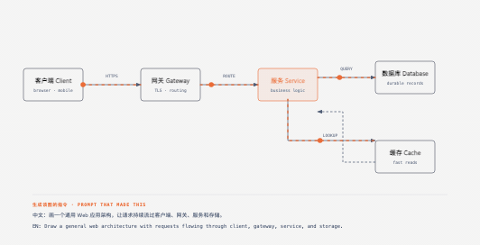</a><br><b>Architecture</b><br><sub>Components + connections</sub></td>
  <td align="center" width="33%"><a href="docs/screenshots/it-state.png"></a><br><b>IT current-state</b><br><sub>Legacy landscape + modernization</sub></td>
  <td align="center" width="33%"><a href="skills/diagram-design-fly/assets/example-flowchart-flow.html">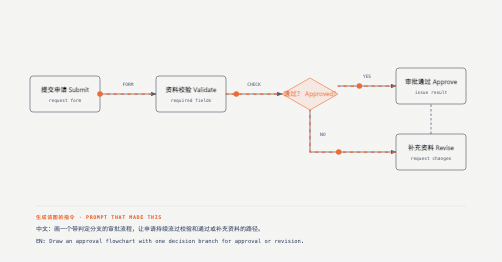</a><br><b>Flowchart</b><br><sub>Decision logic</sub></td>
</tr>
<tr>
  <td align="center"><a href="skills/diagram-design-fly/assets/example-sequence-flow.html">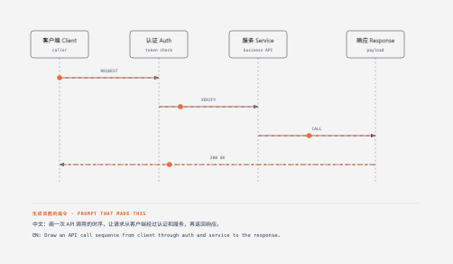</a><br><b>Sequence</b><br><sub>Messages over time</sub></td>
  <td align="center"><a href="skills/diagram-design-fly/assets/example-state-flow.html">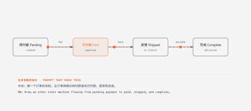</a><br><b>State machine</b><br><sub>States + transitions</sub></td>
  <td align="center"><a href="docs/screenshots/er.png"></a><br><b>ER / data model</b><br><sub>Entities + fields</sub></td>
</tr>
<tr>
  <td align="center"><a href="skills/diagram-design-fly/assets/example-timeline-flow.html">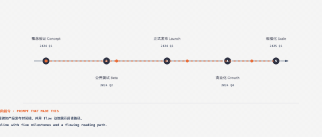</a><br><b>Timeline</b><br><sub>Events on an axis</sub></td>
  <td align="center"><a href="skills/diagram-design-fly/assets/example-swimlane-flow.html">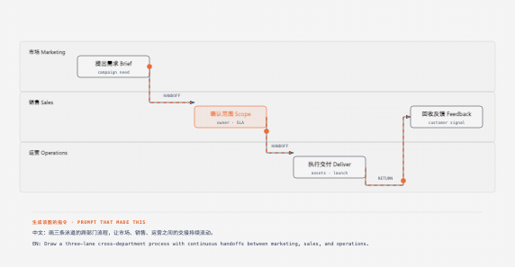</a><br><b>Swimlane</b><br><sub>Cross-functional flow</sub></td>
  <td align="center"><a href="docs/screenshots/quadrant.png"></a><br><b>Quadrant</b><br><sub>Two-axis positioning</sub></td>
</tr>
<tr>
  <td align="center"><a href="docs/screenshots/radar.png"></a><br><b>Radar / spider</b><br><sub>Multi-axis comparison</sub></td>
  <td align="center"><a href="skills/diagram-design-fly/assets/example-loop-flow.html">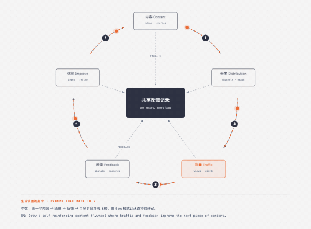</a><br><b>Loop / flywheel</b><br><sub>Reinforcing cycle + shared hub</sub></td>
  <td align="center"><a href="docs/screenshots/nested.png"></a><br><b>Nested</b><br><sub>Hierarchy by containment</sub></td>
</tr>
<tr>
  <td align="center"><a href="docs/screenshots/tree.png"></a><br><b>Tree</b><br><sub>Parent → children</sub></td>
  <td align="center"><a href="docs/screenshots/org-chart.png"></a><br><b>Org chart</b><br><sub>Ownership + routing</sub></td>
  <td align="center"><a href="docs/screenshots/layers.png"></a><br><b>Layer stack</b><br><sub>Stacked abstractions</sub></td>
</tr>
<tr>
  <td align="center"><a href="docs/screenshots/venn.png"></a><br><b>Venn</b><br><sub>Set overlap</sub></td>
  <td align="center"><a href="docs/screenshots/pyramid.png"></a><br><b>Pyramid / funnel</b><br><sub>Ranked hierarchy or drop-off</sub></td>
  <td align="center"><a href="docs/screenshots/bar.png"></a><br><b>Bar chart</b><br><sub>Categorical comparison</sub></td>
</tr>
<tr>
  <td align="center"><a href="docs/screenshots/treemap.png"></a><br><b>Treemap</b><br><sub>Part-of-whole by area</sub></td>
  <td align="center"><a href="docs/screenshots/line.png"></a><br><b>Line chart</b><br><sub>Trends over time</sub></td>
  <td align="center"><a href="skills/diagram-design-fly/assets/example-gantt-flow.html">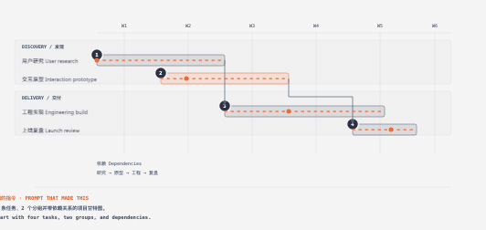</a><br><b>Gantt</b><br><sub>Tasks + phases on a timeline</sub></td>
</tr>
<tr>
  <td align="center"><a href="docs/screenshots/scatter.png"></a><br><b>Scatter plot</b><br><sub>Distribution + correlation</sub></td>
  <td align="center"><a href="skills/diagram-design-fly/assets/example-high-level-flow.html">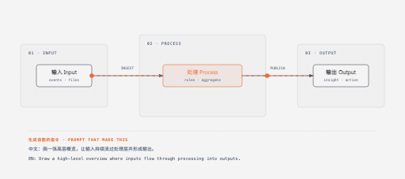</a><br><b>High-Level</b><br><sub>End-to-end stack on a cluster</sub></td>
  <td align="center"><a href="skills/diagram-design-fly/assets/example-process-flow.html">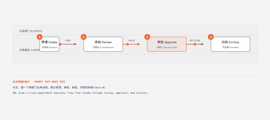</a><br><b>Process</b><br><sub>Multi-actor sequential workflow</sub></td>
</tr>
<tr>
  <td align="center"><a href="skills/diagram-design-fly/assets/example-medallion-flow.html">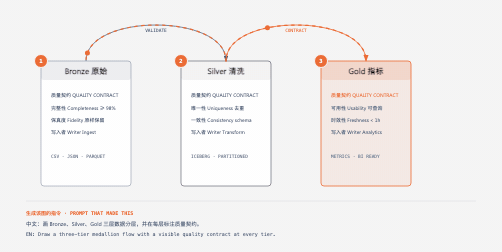</a><br><b>Medallion</b><br><sub>Multi-tier data storage</sub></td>
  <td align="center"><a href="skills/diagram-design-fly/assets/example-data-flow-flow.html">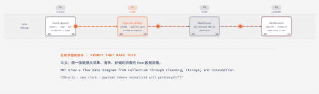</a><br><b>Data flow</b><br><sub>Role-scoped pipeline steps</sub></td>
  <td align="center"><a href="skills/diagram-design-fly/assets/example-dp-integration-flow.html">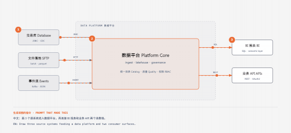</a><br><b>DP integration</b><br><sub>Sources → core → consumers</sub></td>
</tr>
<tr>
  <td align="center"><a href="docs/screenshots/dp-security-matrix.png"></a><br><b>DP security matrix</b><br><sub>Per-role access permissions</sub></td>
  <td align="center"><a href="docs/screenshots/sankey.png"></a><br><b>Sankey</b><br><sub>Quantities that split + merge</sub></td>
  <td align="center"><a href="docs/screenshots/fishbone.png"></a><br><b>Fishbone</b><br><sub>Grouped causes → one effect</sub></td>
</tr>
<tr>
  <td align="center"><a href="docs/screenshots/wardley.png"></a><br><b>Wardley map</b><br><sub>Value chain × evolution</sub></td>
  <td align="center"><a href="skills/diagram-design-fly/assets/example-kanban-flow.html">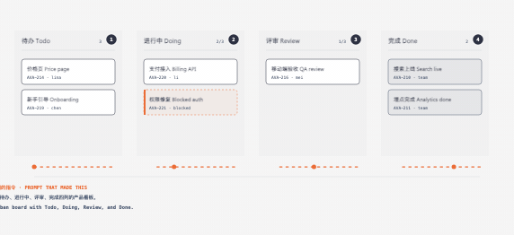</a><br><b>Kanban</b><br><sub>Work in progress by state</sub></td>
  <td align="center"><a href="skills/diagram-design-fly/assets/example-journey-flow.html">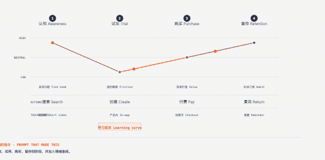</a><br><b>User journey</b><br><sub>Stages, actions + sentiment</sub></td>
</tr>
<tr>
  <td align="center"><a href="skills/diagram-design-fly/assets/example-deployment-flow.html">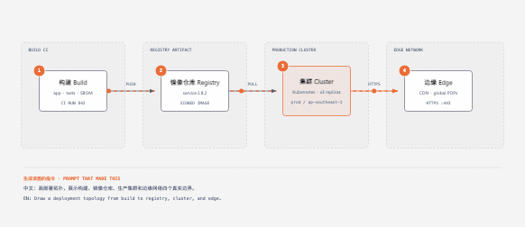</a><br><b>Deployment</b><br><sub>Zones, hosts + artifacts</sub></td>
  <td align="center"><a href="docs/screenshots/dependency.png"></a><br><b>Dependency graph</b><br><sub>Fan-in, ranks + cycles</sub></td>
  <td align="center"><a href="docs/screenshots/uml-class.png"></a><br><b>UML class</b><br><sub>Classes, operations + typed relations</sub></td>
</tr>
<tr>
  <td align="center"><a href="skills/diagram-design-fly/assets/example-story-map-flow.html">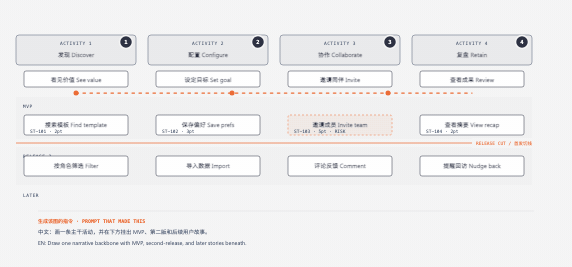</a><br><b>Story map</b><br><sub>Backbone × release slices</sub></td>
  <td align="center"><a href="docs/screenshots/db-schema.png"></a><br><b>Database schema</b><br><sub>Physical tables + column FKs</sub></td>
  <td align="center"><a href="docs/screenshots/polar.png"></a><br><b>Polar chart</b><br><sub>Cyclic magnitude · linear radius</sub></td>
</tr>
</table>

The v2.5.10 release added the final ten types above. Compare their light, dark, and full-editorial variants in the [30-variant contact sheet](.github/pr-previews/editorial-diagrams-2.5.10.jpg).

**Live site:** [huangzhuxing.github.io/diagram-design-fly](https://huangzhuxing.github.io/diagram-design-fly/) — every flow example playing for real, not recorded, plus the OpsPilot page above. The full 39-type gallery is at [`/gallery.html`](https://huangzhuxing.github.io/diagram-design-fly/gallery.html). Offline, open [`skills/diagram-design-fly/assets/index.html`](skills/diagram-design-fly/assets/index.html) locally to flip through all 39 diagrams with light / dark / full-editorial tabs.

---

## Install

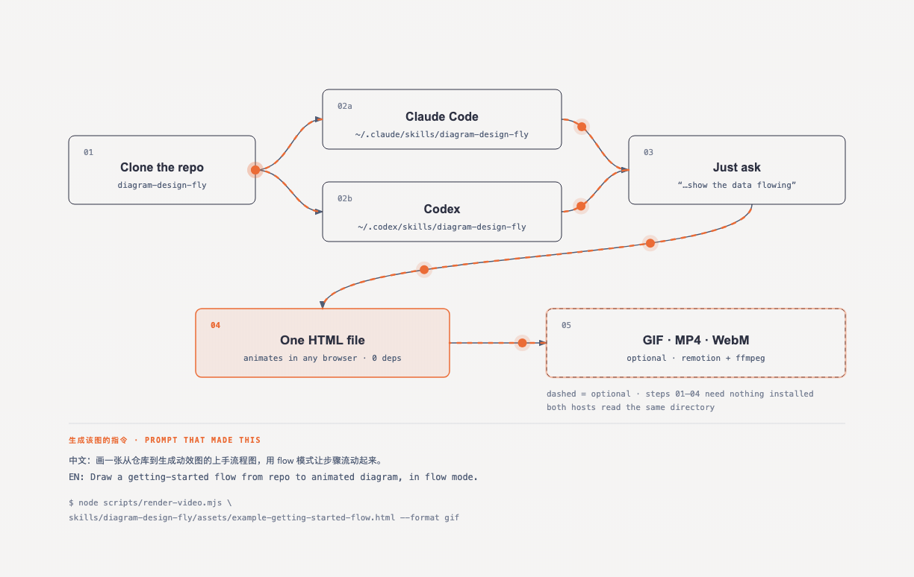

*Steps 01–04 need nothing installed beyond the skill itself; only the video export does.* ([source](skills/diagram-design-fly/assets/example-getting-started-flow.html))

<details>
<summary><b>Try it / 生成这张图的提示词</b></summary>

```text
中文：画一张从仓库到生成动效图的上手流程图，用 flow 模式让步骤流动起来。
EN:   Draw a getting-started flow from repo to animated diagram, in flow mode.
```
```bash
node scripts/render-video.mjs skills/diagram-design-fly/assets/example-getting-started-flow.html --format gif
```
</details>

**Claude Code:**

```text
/plugin marketplace add huangzhuxing/diagram-design-fly
/plugin install diagram-design-fly@diagram-design-fly
```

Then enable updates once: run `/plugin`, open **Marketplaces**, select **diagram-design-fly**, and choose **Enable auto-update**. Claude Code disables auto-update by default for third-party marketplaces; after this toggle, it refreshes the marketplace and installed plugin in the background after startup. Run `/reload-plugins` when prompted, or let the next session load the update.

**Codex:**

```bash
codex plugin marketplace add huangzhuxing/diagram-design-fly
codex plugin add diagram-design-fly@diagram-design-fly
```

Codex refreshes configured Git marketplaces at startup. To fetch immediately, run `codex plugin marketplace upgrade diagram-design-fly` and start a new session.

**Factory Droid:**

```bash
droid plugin marketplace add https://github.com/huangzhuxing/diagram-design-fly
droid plugin install diagram-design-fly@diagram-design-fly --scope user
```

Droid tracks Git plugins by commit rather than the manifest's display version. To fetch a merged update, run `droid plugin marketplace update diagram-design-fly`, then `droid plugin update diagram-design-fly@diagram-design-fly --scope user`, and start a new session.

**Claude Cowork (organization marketplace):** Organization GitHub marketplaces currently require a private or internal repository, so first mirror this public repository into one owned by your organization. In **Organization settings → Plugins**, choose **Add plugin → GitHub**, connect that mirror, and enable **Sync automatically** from the marketplace menu. Automatic sync runs when a pull request containing a plugin version bump is merged to the mirror's default branch; direct pushes do not trigger the webhook. Install Diagram Design from the resulting organization marketplace.

**Pi:**

```bash
pi install https://github.com/huangzhuxing/diagram-design-fly
```

Run `/reload` in an open Pi session. Pi makes the skill available for matching diagram requests; use `/skill:diagram-design-fly` to invoke it explicitly. Pi also loads the `/export-diagram`, `/import-mermaid`, `/profile`, and `/doctor` prompt templates. The unpinned Git install is intentional: Pi has no automatic package refresh, so run `pi update --extensions` to pull merged updates.

**Kiro:** Import the Agent Skill from the repository subdirectory URL:

```text
https://github.com/huangzhuxing/diagram-design-fly/tree/main/skills/diagram-design-fly
```

Kiro copies imported skills into `.kiro/skills/` for a workspace or `~/.kiro/skills/` globally, so re-import the URL to pick up updates. Custom agents that declare resources should include `skill://diagram-design-fly/**/SKILL.md`.

**OpenCode:** Copy or symlink `skills/diagram-design-fly/` to `.opencode/skills/diagram-design-fly` in a project or `~/.config/opencode/skills/diagram-design-fly` globally. OpenCode has no Diagram Design marketplace package; copied installs update only when you replace the directory from a newer checkout.

> **One-time migration:** an existing standalone `npx skills add` copy will not start following the Codex marketplace automatically. Remove that standalone copy, then use the Codex marketplace commands above. Likewise, uninstall a personal Cowork copy and reinstall Diagram Design from your organization's marketplace. Future marketplace version bumps then flow through each client's native update path.

### Editable install

Managed installs are convenient, but changes to `references/style-guide.md` may be replaced by package updates. Saved profiles in `~/.diagram-design-fly/profiles/` survive updates, and projects with a `.diagram-design-fly` marker are unaffected. Clone the repo and install the local path if you plan to customize the working style guide directly:

```bash
git clone git@github.com:huangzhuxing/diagram-design-fly.git ~/code/diagram-design-fly

# Pi: register the checkout as a local package
pi install ~/code/diagram-design-fly

# Claude Code: symlink the inner skill
ln -s ~/code/diagram-design-fly/skills/diagram-design-fly ~/.claude/skills/diagram-design-fly

# Other Agent Skills hosts: create only the roots you use
mkdir -p ~/.agents/skills ~/.cursor/skills ~/.cline/skills ~/.kiro/skills ~/.config/opencode/skills
ln -s ~/code/diagram-design-fly/skills/diagram-design-fly ~/.agents/skills/diagram-design-fly
ln -s ~/code/diagram-design-fly/skills/diagram-design-fly ~/.cursor/skills/diagram-design-fly
ln -s ~/code/diagram-design-fly/skills/diagram-design-fly ~/.cline/skills/diagram-design-fly
ln -s ~/code/diagram-design-fly/skills/diagram-design-fly ~/.kiro/skills/diagram-design-fly
ln -s ~/code/diagram-design-fly/skills/diagram-design-fly ~/.config/opencode/skills/diagram-design-fly
```

The shared skill lives at `skills/diagram-design-fly/`. Pi discovers it through the repo's standard `skills/` package directory; Claude Code, Codex, Factory Droid, and other Agent Skills-compatible tools use the same files.

---

## Onboarding — make it look like *your* brand

The whole point: ship editorial-quality diagrams in **your** colors and typography, not a generic template.

Out of the box, diagrams render in a clean **jet-black + atomic-tangerine** palette (white-smoke paper, jet-black ink, atomic-tangerine accent, blue-slate muted, silver hairlines). Good enough to screenshot straight away. But 60 seconds of onboarding is better — the skill will pull your brand from your website and apply it across every diagram.

### The flow

```
You:     "onboard diagram-design-fly to https://yoursite.com"
Agent:   → fetches the homepage
         → extracts the dominant palette + font stack
         → maps detected values to semantic roles:
             paper, ink, muted, accent, link
         → shows a proposed diff
         → writes your tokens to references/style-guide.md
You:     "yes, apply it"
```

Every new diagram now uses your colors. Your website's paper color becomes the diagram background. Your CTA color becomes the focal accent. Your body font stack becomes the node label family.

Brand matching also emits a fidelity receipt: sampled URLs, exact color roles, font families and weights, font source URLs, and any fallback. Public site fonts are used directly and verified after rendering rather than silently replaced with generic system fonts.

### What gets extracted

| Detected from your site | Becomes |
|---|---|
| `<body>` background | `paper` token |
| Primary text color | `ink` token |
| Secondary / caption text | `muted` token |
| Cards or containers | `paper-2` token |
| Most-used brand color (CTA, link, heading) | `accent` token |
| `<h1>` font family | `title` font |
| `<body>` font family | `node-name` font |
| `<code>` / `<pre>` font | `sublabel` font |

### Contrast checks happen automatically

Before writing tokens, the skill verifies WCAG AA contrast on `ink` over `paper`. If your site has a color that fails contrast at diagram sizes (9–12px), it proposes an adjusted value and explains why.

### Accessible by default

Every diagram template gives the inline SVG an accessible name and description: `role="img"`, a resolving `aria-labelledby`, and first-child `<title>` / `<desc>` slots. IDs are prefixed per diagram and variant, so multiple SVG exports can be safely inlined on one page without duplicate accessible-name IDs. Decorative specimen icons are hidden from assistive technology instead.

### Manual override

Prefer to set tokens by hand? Open [`skills/diagram-design-fly/references/style-guide.md`](skills/diagram-design-fly/references/style-guide.md) and edit the table. Everything downstream reads from there — all 39 diagrams, the annotation primitive, and the gallery all inherit semantic role names (`accent`, not `#eb6c36`).

### First-run gate

The skill won't silently ship default-skinned diagrams into a branded project. On first use in a new project, it checks if `style-guide.md` has been customized. If not, it pauses and asks:

> *"This is your first diagram in this project. The style guide is still at the default. Want to run onboarding, paste tokens manually, or proceed with default?"*

See [`skills/diagram-design-fly/references/onboarding.md`](skills/diagram-design-fly/references/onboarding.md) for the full spec.

### Working with multiple clients

Onboard a brand once, save the result as a named profile, then add a `.diagram-design-fly` marker containing `profile: <slug>` to each client project. Marker projects read `~/.diagram-design-fly/profiles/<slug>.md` directly, so parallel workspaces can use different brands without overwriting a shared installed `style-guide.md`.

The profile library is shared across Claude Code, Codex, Factory Droid, and Pi. Use `/diagram-design-fly:profile` in Claude Code, `/profile` in Factory Droid or Pi, or ask in natural language in any host. See [`profiles.md`](skills/diagram-design-fly/references/profiles.md) for the storage, marker, and recovery contract.

---

## Quickstart

```bash
# From a cloned checkout, open the gallery to see all 39 diagrams
open skills/diagram-design-fly/assets/index.html       # macOS
xdg-open skills/diagram-design-fly/assets/index.html  # Linux

# In Claude Code, Codex, Factory Droid, or Pi, ask:
# "Make me an architecture diagram of my app: frontend, backend, database, Redis cache."
# "I need a quadrant showing Q2 projects by impact vs effort."
# "Give me a sequence of a bearer call with token refresh on 401."
# (branching refresh uses the ALT combined-fragment grammar in type-sequence.md;
#  see skills/diagram-design-fly/assets/example-sequence-oauth.html — not a full authorize-code handshake)
```

Operator recipes for editable installs, first diagrams, brand setup, import, export, validation, Windows junctions, and reusable prompts live in [`docs/cookbook.md`](docs/cookbook.md).

Your agent will pick the right type, build the HTML, and save it. You can also start from a template directly:

```bash
cp skills/diagram-design-fly/assets/template.html my-diagram.html        # minimal light
cp skills/diagram-design-fly/assets/template-full.html my-diagram.html   # editorial with summary cards
cp skills/diagram-design-fly/assets/template-motion.html my-diagram.html # optional accessible motion
```

### Semantic patterns and optional motion

When behavior matters, the skill chooses a semantic pattern first and a visual type second. The eight routed patterns cover fan-in queues and bottlenecks, repeated stage slots, unstructured-input transformation, paired policy traces, secure paved roads, governance catalogs, compensating security layers, and traceable block decomposition. Each pattern defines its triggers, primitives, budget, anti-patterns, static fallback, and nearest visual type in [`semantic-patterns.md`](skills/diagram-design-fly/references/semantic-patterns.md).

Motion is optional and does not create another visual type. [`animation.md`](skills/diagram-design-fly/references/animation.md) defines `none`, `reveal`, `step`, and `loop` modes with a complete static first frame, deterministic timing, and controls when interaction is available. Reduced-motion output shows the complete static frame and hides/disables playback controls. Motion HTML uses the exact reviewed controller from `template-motion.html`; arbitrary or modified inline scripts, remote assets, CSS imports, and executable HTML attributes are rejected. The default is `none`: ordinary output remains static and script-free. [`example-policy-trace-animated.html`](skills/diagram-design-fly/assets/example-policy-trace-animated.html) is the self-contained interactive example.

---

## Flow — diagrams that move

`step` and `reveal` narrate an ordered change and finish. **`flow` is for movement with no beginning or end** — material through a pipeline, requests over a boundary, a cycle turning. Ask for it in those words and the skill routes there:

> "Make me an architecture diagram of my ingest pipeline, and show the data flowing through it."

### One mechanism

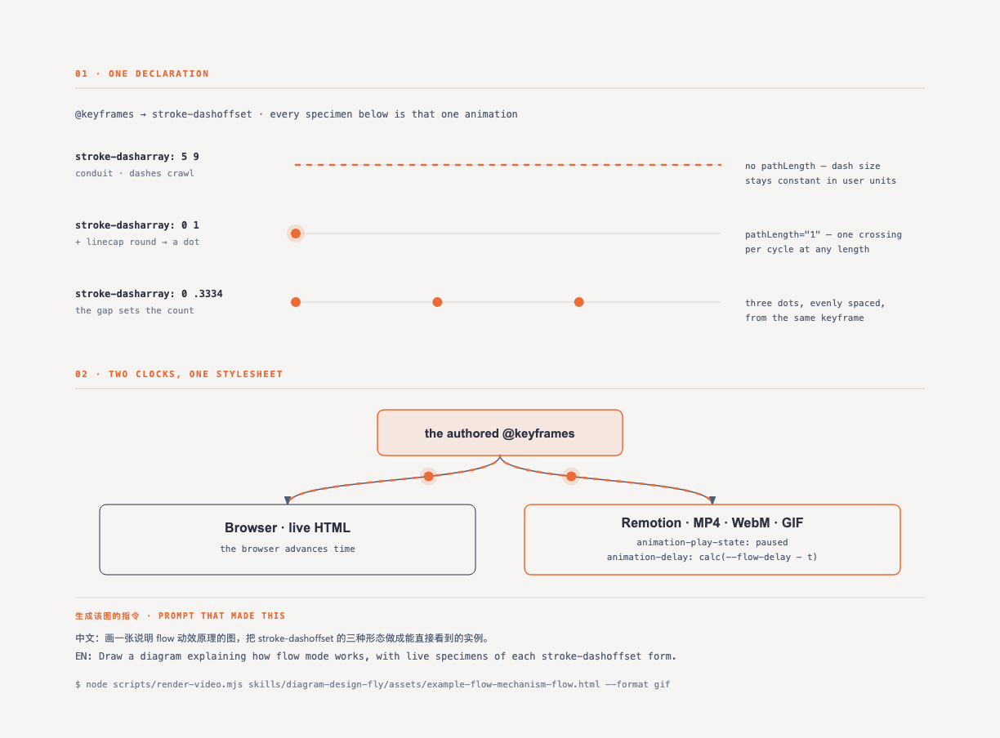

*The three specimens in that figure are live: each is the exact declaration printed beside it.* ([source](skills/diagram-design-fly/assets/example-flow-mechanism-flow.html))

<details>
<summary><b>Try it / 生成这张图的提示词</b></summary>

```text
中文：画一张说明 flow 动效原理的图，把 stroke-dashoffset 的三种形态
      做成能直接看到的实例。
EN:   Draw a diagram explaining how flow mode works, with live specimens of
      each stroke-dashoffset form.
```
```bash
node scripts/render-video.mjs skills/diagram-design-fly/assets/example-flow-mechanism-flow.html --format gif
```
</details>

There is no `offset-path`, no `<animateMotion>`, no per-frame JavaScript, and no measured geometry. Everything is an animated `stroke-dashoffset`:

```css
/* Conduit — dashes crawling inside the pipe. */
.flow-stream { stroke-dasharray: 5 9; }                    /* period 14 */
@keyframes flow-stream { to { stroke-dashoffset: -70; } }  /* 5 periods */

/* Token — a zero-length dash with a round cap is a dot. */
.flow-token  { stroke-dasharray: 0 var(--token-gap, 1); stroke-linecap: round; }
@keyframes flow-token { to { stroke-dashoffset: 0; } }
```

Two things fall out of that, and both matter:

- **It follows any path.** Straight runs, orthogonal routes, and long beziers all animate from one declaration, because the dash travels along the path's own length. The big S-curve in the header GIF needs no special case.
- **The loop is seamless when the travelled distance is a whole number of dash periods.** `-70` over a period of `14` is exactly five. [`verify-flow.py`](scripts/verify-flow.py) checks that arithmetic, because getting it wrong produces a visible jump once per cycle and nothing else catches it.

Tokens carry `pathLength="1"` so one crossing takes one cycle whether the edge is 76px or 900px. Conduits deliberately do not — normalising them would cut a short connector into the same number of dashes as a long curve, and the diagram would lose its single rhythm.

### It stays a diagram

`flow` is a presentation layer over a complete static figure, and the tooling enforces that rather than trusting it:

| | |
|---|---|
| **No JavaScript** | The whole mode is CSS. Nothing to review, nothing to break, nothing to run. |
| **Complete without motion** | Delete the flow layer and the diagram still reads. `?motion=static`, print, and `prefers-reduced-motion` all resolve to that frame. |
| **Budgeted** | 8 connectors, 16 tokens, one clock, a 2.5–6s cycle. Flow shares the static diagram's complexity budget instead of raising it. |
| **Verified** | [`verify-flow.py`](scripts/verify-flow.py) checks budgets, phase, normalisation, and seam arithmetic; [`test-verify-flow.py`](scripts/test-verify-flow.py) mutates the canonical template 27 ways to prove each rule still fires. |

Full contract: [`flow.md`](skills/diagram-design-fly/references/flow.md). Start from [`template-flow.html`](skills/diagram-design-fly/assets/template-flow.html).

### Optional: stage numbers


Off by default. Turn them on when a reader would otherwise have to guess which end to start at — a pipeline that folds onto a second row, a ring, a fan-out whose branches are not obviously parallel:

```html
<main data-motion-root data-motion-mode="flow" data-flow-cycle="4.4"
      data-flow-sequence="5">
  <g class="flow-seq" data-seq="1">
    <circle cx="440" cy="68" r="13"/><text x="440" y="68">1</text>
  </g>
```

**They mean reading order, not elapsed time.** Flow has no beginning — material is in every stage at once, and the figure looks the same at second 1 and second 100. A number says *start reading here*. If what you mean is "first this happens, then that", that is `step` mode in [`animation.md`](skills/diagram-design-fly/references/animation.md): it has a controller, it finishes, and it can be paused on any frame.

The badge lives in the **base layer**, never in `data-motion-decorative` — a number is meaning, and the decorative layer is exactly what print, reduced motion, and static capture delete. `verify-flow.py` enforces that, plus all-or-nothing declaration, contiguous `1..N`, and a 2–9 ceiling.

**Put them on the nodes or on the lines.** A badge at a node's corner reads "this is stage 3"; one at a conduit's midpoint reads "this is hand-off 3". Rings and linear chains suit the second, fan-outs the first. On a conduit, place the badge *after* the decorative group in document order — still outside it, so it survives static capture, but painted last so travelling tokens cannot cross over the number.

### Render it to video

```bash
cd remotion && npm install          # once
node scripts/render-video.mjs my-diagram.html --format gif
```

`--format` takes `gif`, `mp4`, or `webm`. Both GIFs in this README were produced by [`render-motion-assets.mjs`](scripts/render-motion-assets.mjs), which is also the thing that tells you when a committed asset has gone stale:

```bash
node scripts/render-motion-assets.mjs --check
```

The renderer does not reimplement the animation. It runs the diagram's own stylesheet and moves the clock:

```css
*, *::before, *::after {
  animation-play-state: paused !important;
  animation-delay: calc(var(--flow-delay, 0s) - {t}s) !important;
}
```

`paused` stops the clock; a negative delay seeks it. The `calc()` reads each element's own `--flow-delay`, so per-element phase survives the seek. **The video cannot drift from the page** — both run the same keyframes from the same stylesheet and differ only in who advances time. Frame *n* depends on *n* alone, so two renders of one source are identical, and one cycle is a seamless loop by construction.

Details, formats, and sizing: [`video-export.md`](skills/diagram-design-fly/references/video-export.md).

Authoring a flow diagram needs none of this installed. Remotion is an optional export layer; the HTML animates on its own in any browser.

---

## Import from draw.io or Mermaid

Already have diagrams in draw.io / diagrams.net or Mermaid? Point the skill at the source and it **redraws** them — same content, this design system, at whatever the destination needs.

[](docs/screenshots/import-drawio.png)

*A 12-node draw.io file redrawn at `balanced` detail for a blog post. The source's six pastel fills became one accent; its hand-dragged coordinates became a 4px grid.*

```
/diagram-design-fly:import-drawio platform.drawio
/diagram-design-fly:import-drawio platform.drawio --size=slide-16x9 --detail=simplified --audience=executive
/diagram-design-fly:import-drawio platform.drawio --detail=faithful --format=png --page=all
/diagram-design-fly:import-mermaid README.md --diagram=all
/diagram-design-fly:import-mermaid architecture.mmd --size=slide-16x9 --detail=simplified
```

Or just ask: *"redraw this drawio file for my deck"*, *"make this Mermaid block editorial"*, or *"この Mermaid をスライド用にきれいにして"*.

Reads the common containers draw.io writes — `.drawio`, `.drawio.xml`, `.drawio.png` (embedded diagram), and `.drawio.svg` — including compressed payloads that look like base64 garbage in an editor.
For Mermaid, it accepts `.mmd`, `.mermaid`, and one or more fenced `mermaid` blocks in Markdown. It parses text only: no rendering, JavaScript, browser, network, or followed click targets.

### The four dials

The point isn't conversion, it's **fitting the output to where it's going**. Same source file, three different diagrams:

| Dial | Options | What it changes |
|---|---|---|
| **Format** | `html` · `svg` · `png` · `html+png` | The deliverable. SVG for Figma, PNG for slides, HTML for the web. |
| **Size** | `doc-inline` · `doc-wide` · `slide-16x9` · `slide-4x3` · `social-og` · `social-square` · `print-a4-landscape` · `print-letter-landscape` · `fit` | The `viewBox` **and the type ramp** — a projected slide gets 16px node names, not 12px. |
| **Detail** | `faithful` (≤24 nodes, zoned) · `balanced` (≤12) · `simplified` (≤7) | How much of the source survives, via a fixed degrade ladder — decorations, then duplicates, then leaf clusters, then infrastructure. |
| **Audience** | `engineer` · `mixed` · `executive` | The *wording*, not the count. `Auth Service / JWT · RS256 · :8443` → `Auth Service / token check` → `Sign-in`. |

Every import ends with a **fidelity ledger** — what got merged, collapsed, or dropped. You know the source; you'd notice anyway.

```
Detail: balanced · 12 source nodes → 8 drawn
Collapsed: "Token valid?" decision → edge label on Gateway → Auth
Dropped:   1 sticky note ("legacy path, to be retired") — unconnected in source
Kept in full: the request path (Web/Mobile → Gateway → Orders → Postgres)
```

What never carries over: source or renderer coordinates, source palette, source fonts, draw.io's diagonal connector spaghetti, or Mermaid's automatic layout. What always does: components, relationships, grouping, and direction. See [`references/import-drawio.md`](skills/diagram-design-fly/references/import-drawio.md), [`references/import-mermaid.md`](skills/diagram-design-fly/references/import-mermaid.md), and [`references/output-spec.md`](skills/diagram-design-fly/references/output-spec.md).

---

## Export to PNG / SVG

Diagrams ship as self-contained HTML, but you can export the diagram itself for Figma, slides, or social cards. (For video, see [Render it to video](#render-it-to-video) above.) Use the slash command for your agent:

**Pi:**

```
/export-diagram path/to/diagram.html
/export-diagram path/to/diagram.html --svg-only
/export-diagram path/to/diagram.html --png-only --scale=3
/export-diagram path/to/diagram.html --registry
```

**Claude Code:**

```
/diagram-design-fly:export-diagram path/to/diagram.html
/diagram-design-fly:export-diagram path/to/diagram.html --svg-only
/diagram-design-fly:export-diagram path/to/diagram.html --png-only --scale=3
/diagram-design-fly:export-diagram path/to/diagram.html --registry
```

Or just ask in natural language:

```
"Export this diagram as SVG and PNG."
"Save my-diagram.html as PNG."
```

- **SVG** — extracts the `<svg>` node and injects Google Fonts so it renders standalone in browsers, Figma, and Illustrator.
- **PNG** — rasterizes the diagram via Playwright at 2× by default. One-time setup: `pip install playwright && playwright install chromium`.

Both formats are diagram-only — editorial cards and headers from `-full` variants aren't included. For a screenshot of the full editorial layout, use your browser's print-to-PDF or full-page screenshot. See [`skills/diagram-design-fly/references/export.md`](skills/diagram-design-fly/references/export.md) for the full procedure.

- **`--registry`** — for diagrams using the [traceable block decomposition](skills/diagram-design-fly/references/semantic-patterns.md) pattern, also emits `<basename>.registry.json`, a structured projection of every block's `data-block-*` metadata. Combine with either raster format or run alone. See [`skills/diagram-design-fly/references/export-registry.md`](skills/diagram-design-fly/references/export-registry.md).

For motion-enabled HTML, export the explicit final state: open `?motion=static`, wait for `document.fonts.ready`, and confirm the motion root has `data-frame="static"` before capture. Use `?motion=step&step=N` only when a named intermediate frame was requested.

---

## Architecture

Progressive disclosure. `SKILL.md` routes behavior first when needed, then layout. Semantic, type, animation, and flow references load only when relevant.

```
diagram-design-fly/
├── .agents/plugins/marketplace.json — Codex marketplace catalog
├── .claude-plugin/                  — Claude marketplace + plugin manifest
├── .codex-plugin/                   — Codex plugin manifest
├── .factory-plugin/                 — Factory Droid marketplace + plugin manifest
├── commands/
│   ├── export-diagram.md            — plugin export command
│   ├── import-drawio.md             — plugin draw.io import command
│   ├── import-mermaid.md            — plugin Mermaid import command
│   ├── profile.md                   — plugin client-profile command
│   └── doctor.md                    — plugin environment diagnostics command
├── prompts/
│   ├── export-diagram.md            — Pi `/export-diagram` prompt template
│   ├── import-mermaid.md            — Pi Mermaid import prompt template
│   ├── profile.md                   — Pi `/profile` prompt template
│   └── doctor.md                    — Pi `/doctor` diagnostics prompt template
├── skills/
│   └── diagram-design-fly/
│       ├── SKILL.md                 — philosophy, selection guide, checklist
│       ├── references/              — loaded only when a type or primitive is chosen
│       │   ├── style-guide.md       — single source of truth for colors + fonts
│       │   ├── semantic-patterns.md — behavior patterns independent of layout
│       │   ├── animation.md         — optional motion + accessibility contract
│       │   ├── flow.md              — continuous movement: pipelines, cycles
│       │   ├── video-export.md      — MP4 / WebM / GIF rendering
│       │   ├── onboarding.md        — the URL-to-tokens flow
│       │   ├── profiles.md          — named client profiles + project markers
│       │   ├── import-drawio.md     — draw.io redraw procedure
│       │   ├── import-mermaid.md    — Mermaid redraw procedure
│       │   ├── output-spec.md       — format × size × detail level
│       │   ├── export.md            — SVG / PNG export + sizing
│       │   ├── export-registry.md   — block-metadata JSON sidecar export
│       │   ├── type-architecture.md
│       │   ├── type-flowchart.md
│       │   ├── type-sequence.md
│       │   ├── type-state.md
│       │   ├── type-er.md
│       │   ├── type-timeline.md
│       │   ├── type-swimlane.md
│       │   ├── type-quadrant.md
│       │   ├── type-nested.md
│       │   ├── type-tree.md
│       │   ├── type-org-chart.md
│       │   ├── type-layers.md
│       │   ├── type-venn.md
│       │   ├── type-pyramid.md
│       │   ├── type-sankey.md
│       │   ├── type-fishbone.md
│       │   ├── type-wardley.md
│       │   ├── type-kanban.md
│       │   ├── type-journey.md
│       │   ├── type-deployment.md
│       │   ├── type-dependency.md
│       │   ├── type-uml-class.md
│       │   ├── type-story-map.md
│       │   ├── type-db-schema.md
│       │   ├── primitive-annotation.md
│       │   ├── primitive-sketchy.md
│       │   └── primitive-terminal.md
│       ├── scripts/
│       │   ├── drawio_extract.py    — draw.io → structured IR
│       │   ├── mermaid_extract.py   — Mermaid → structured IR
│       │   └── self_check.py        — packaged output self-check (runs installed)
│       └── assets/
│           ├── index.html           — live gallery, tabbed
│           ├── template*.html       — scaffolds for new diagrams
│           ├── example-<type>.html  — 3 variants × 39 types
│           ├── example-loop-terminal.html
│           ├── example-quadrant-consultant.html
│           ├── example-import-drawio.html
│           ├── example-import-mermaid.html
│           ├── example-policy-trace-animated.html
│           └── example-sequence-oauth*.html
├── scripts/
│   ├── build-readme-thumbs.py       — regenerates docs/screenshots/thumbs/
│   ├── bump-plugin-version.py       — synchronized Claude/Codex/Factory version bump
│   ├── render-canonical-screenshots.py — deterministic 39-type PNG catalog renderer
│   ├── verify-screenshot-freshness.py — source + screenshot digest gate
│   ├── verify-plugin-package.py     — version + marketplace package gate
│   ├── test-plugin-package.py       — adversarial package-gate tests
│   ├── lint-render.py               — Chromium rendered-layout checker
│   ├── verify-doctor.py             — doctor diagnostics contract gate
│   ├── test-verify-doctor.py        — doctor diagnostics adversarial tests
│   ├── verify-polar.py              — quantitative polar encoding gate
│   ├── test-verify-polar.py         — polar gate adversarial tests
│   ├── verify-sankey.py             — Sankey conservation + geometry gate
│   ├── test-verify-sankey.py        — Sankey gate adversarial tests
│   ├── test-verify-docs-sync.py     — docs/routing-surface gate tests
│   ├── verify-flow.py               — flow budgets, phase, seam arithmetic
│   ├── test-verify-flow.py          — flow gate adversarial tests
│   ├── render-video.mjs             — one diagram → MP4 / WebM / GIF
│   ├── render-motion-assets.mjs     — regenerates docs/motion/ (--check for staleness)
│   └── fixtures/
│       ├── sample-flowchart.mmd
│       ├── sample-readme-with-mermaid.md
│       └── sample-adversarial.mmd
├── remotion/                        — optional video renderer; not needed to author
│   └── src/DiagramFlow.tsx          — replays the diagram's CSS with the clock frozen
├── docs/cookbook.md                 — operator recipes for editable installs and common tasks
├── docs/adr/                        — short records of settled design decisions
├── docs/motion/                     — committed GIF/MP4 renders of the flow examples
├── docs/screenshots/                — full-resolution images + source-digest manifest.json
└── docs/screenshots/thumbs/         — generated WebP previews the README renders
```

This keeps the agent's working context tight: routine diagrams load one type reference; behavior-rich diagrams add the routed semantic reference; animation adds its contract only when selected.

### Contributing / skin lint

Before submitting a new example, run `python3 scripts/lint-skin.py <your-new-example.html>`.
The repository-wide check `python3 scripts/lint-skin.py --all --baseline` covers examples and templates and must stay green.
CI separately verifies semantic routing, animated-example structure, animated skin, every shipped motion asset, and adversarial mutations of the controller contract, reporting later gate outcomes even when an earlier gate fails. Semantic routing must pass `python3 scripts/verify-semantic-motion.py --markdown-only`; the animated example has a separate `--example-only` gate. Every shipped motion template/example must also pass `python3 scripts/verify-motion.py --shipped`.
The linter's `a11y` category rejects diagram SVGs without a resolving accessible name,
an empty or misplaced title/description, or unsafe bare `title` / `desc` IDs. It also pins the exact reviewed motion controller and rejects remote assets, CSS `@import`, non-fragment CSS `url()`, and executable attributes such as `onclick` or `srcdoc`.
If you touch the draw.io import path, `python3 scripts/verify-drawio-import.py` must also pass —
it drives the real extractor against `scripts/fixtures/sample-architecture.drawio` in all four
container formats and checks the references stay in sync.
If you touch the Mermaid import path, `python3 scripts/verify-mermaid-import.py` must also pass —
it covers all supported grammars, multi-block Markdown, adversarial labels, trust-boundary
behavior, resource caps, named failures, and reference/command wiring.

Label placement is gated geometrically: `python3 scripts/verify-geometry.py --all` fails CI when a label mask overlaps a node declared later in the document, because the node fill would clip the text at render time. `python3 scripts/test-verify-geometry.py` keeps that checker honest in both directions.
Diagrams using the traceable block decomposition pattern get a structural gate on top of that: `python3 scripts/verify-block-registry.py --all` fails CI on a duplicate `data-block-id`, a `data-block-parent` that doesn't resolve to another block in the same file, a cycle in the parent chain, a blank `data-block-id`, or a missing or blank `data-block-name` — the same defects that would make `--registry`'s exported JSON (see [`export-registry.md`](skills/diagram-design-fly/references/export-registry.md)) misrepresent the tree it claims to describe. `python3 scripts/test-verify-block-registry.py` keeps that checker honest in both directions.
Treemaps get a second geometric gate, because their whole claim is that area *is* the encoding: `python3 scripts/verify-treemap.py --all` fails CI when a cell's share of the drawn area doesn't match the value printed inside it, or when a label overruns the cell it names. It measures area error as a *relative* figure — an absolute one passes exactly the small cells most likely to be wrong. `python3 scripts/test-verify-treemap.py` keeps it honest in both directions.
Docs and routing surfaces are themselves gated: `python3 scripts/verify-docs-sync.py` fails CI if the SKILL.md description loses a type's lexical hook, the gallery can't reach a shipped example, the README tree names a file that doesn't exist, a relative reference link is broken, a scanner-visible support path is not shipped inside the skill package, or any command/prompt surface drifts from its routed reference. `python3 scripts/test-verify-docs-sync.py` exercises those newer checks adversarially, including the strict-bundler behavior used by Hermes Agent. The skill also ships `skills/diagram-design-fly/scripts/self_check.py` — a distilled output checker installed agents can run on their own generated diagrams; `python3 scripts/test-self-check.py` keeps it honest. Settled design decisions (why one pinned controller, why patterns never add types, the autoplay policy, the SKILL.md byte cap, why label placement is verified geometrically, and why client profiles use marker-first resolution) live as short ADRs in `docs/adr/` — read them before relitigating one, add one when you settle a new policy.

All pull requests and pushes are automatically validated across Linux, Windows, and macOS runners via GitHub Actions CI (`.github/workflows/ci.yml`).

`lint-skin.py` reads the source. `lint-render.py` renders it — headless Chromium
reports what actually got painted, which catches content cut off by the SVG
viewport, collapsed SVGs, horizontal page overflow, missing local assets and JS
errors. Both run in CI on every pull request.

```bash
pip install playwright && playwright install chromium   # same dep as PNG export
python3 scripts/lint-render.py --self-test              # checks the checks
python3 scripts/lint-render.py --all                   # examples and templates
python3 scripts/lint-render.py <your-new-example.html>
python3 scripts/lint-render.py --fonts --all           # measure with the real webfonts
```

Clipping is measured by paint, not geometry: `getBoundingClientRect()` on an SVG
child ignores stroke width, markers and filter bleed, and knows nothing about
`clip-path` or `overflow: visible`, so it both misses real clipping and invents
clipping that isn't there. Instead each SVG is screenshot as authored and again
with its `overflow` released, and the two are diffed — ink that appears outside
was being cut off. Releases are staged — the SVG alone, then each clipping
ancestor — so a wrapper release can't mask spill at the SVG's own edge, and an SVG
authored `overflow: visible` inside a clipping wrapper is still checked.
`--self-test` asserts all of that on 23 cases, over half of them cases that must
*not* be flagged, and it also asserts the DOM is byte-identical after measuring.

No golden images, so there is nothing to re-record and no PNGs in the repo.
Network is cut at the browser's resolver, which covers WebSockets and anything
else that bypasses request routing, with request routing as a second layer;
`--fonts` excludes exactly the two Google Fonts hostnames and allows them only
over HTTPS. Since the oracle is pixels, CI pins Playwright and its Chromium build
rather than installing whatever is newest.

**Font metrics differ between the default run and `--fonts`.** With network
blocked — the default, and what CI runs — text is laid out in the fallback faces,
not Instrument Serif and Geist. That is deterministic and machine-independent,
which is what a linter needs, but it is not what your reader sees. Run
`--fonts --all` locally when you care whether real text fits its box.

### What loads when

At startup, the agent sees only the skill name and description. When a request matches, it loads `SKILL.md`; semantic, type, and animation references are pulled in only when relevant.

| You ask for… | Agent loads |
|---|---|
| "Make me a flowchart" | `SKILL.md` + `references/type-flowchart.md` |
| "Build an architecture diagram" | `SKILL.md` + `references/type-architecture.md` |
| "Compare why these two policy requests differ" | `SKILL.md` + `references/semantic-patterns.md` + `references/type-flowchart.md` |
| "Animate that policy trace" | Prior selection + `references/animation.md` |
| "Onboard this skill to my site" | `SKILL.md` + `references/onboarding.md` + `references/style-guide.md` |
| "Use my saved Acme client profile" | `SKILL.md` + `references/profiles.md` + `~/.diagram-design-fly/profiles/acme.md` |
| "Add an editorial callout to this diagram" | `SKILL.md` + `references/primitive-annotation.md` |
| "Give me a hand-drawn version" | `SKILL.md` + `references/primitive-sketchy.md` |
| "Give me a terminal / CLI-window version" | `SKILL.md` + `references/primitive-terminal.md` |
| "Redraw this .drawio file for my deck" | `SKILL.md` + `references/import-drawio.md` + `references/output-spec.md` + the chosen type's reference |
| "Redraw this Mermaid block for my deck" | `SKILL.md` + `references/import-mermaid.md` + `references/output-spec.md` + the chosen type's reference |
| Routine static diagram-making (any of the 39 visual types) | Only `SKILL.md` + that one type's reference |

No matter how many types exist, the agent only reads the one you need. Add a new type tomorrow and nothing else changes.

---

## It's working if…

- A routine request ("make me a flowchart") loads `SKILL.md` plus exactly one type reference — nothing else.
- Before drawing, the agent states the chosen type, pattern, size, and planned cuts, then renders.
- The output is one `.html` file that opens double-clicked, offline, with no network requests beyond Google Fonts.
- Screen readers announce the diagram's title and description; `prefers-reduced-motion` shows the complete static frame.
- `python3 skills/diagram-design-fly/scripts/self_check.py <file>` prints `OK` on the generated file.
- After brand onboarding, new diagrams use your site's paper, ink, accent, and fonts — with a fidelity receipt naming each.

If any of these fail, that's a bug worth filing.

## The design system (in one paragraph)

One accent color, 1–2 focal elements per diagram. Three font families: Instrument Serif (title + italic callouts), Geist sans (node names), Geist Mono (technical sublabels). 1px hairline borders, no shadows, max border-radius 10px. Every coord, width, and gap divisible by 4 — non-negotiable, it's what keeps the diagrams from feeling AI-generated. Mono is for technical content (ports, URLs, field types), not a blanket "dev" aesthetic. Coral-tinted focal nodes draw the eye to the 1–2 things that matter. Full spec in [`SKILL.md`](skills/diagram-design-fly/SKILL.md#5-design-system).

---

## Primitives

- **Annotation callout** — italic Instrument Serif + dashed Bézier leader, for editorial asides that sit in the margins. See [`skills/diagram-design-fly/references/primitive-annotation.md`](skills/diagram-design-fly/references/primitive-annotation.md).
- **Sketchy filter** — SVG turbulence + displacement map for a hand-drawn variant. Good for essays, not for technical docs. See [`skills/diagram-design-fly/references/primitive-sketchy.md`](skills/diagram-design-fly/references/primitive-sketchy.md).
- **Icon set** — 87 monochrome IT/cloud icons (laptop, phone, user, server, database, Docker, Kubernetes, AWS, Azure, GitHub, Postgres…) for richer architecture and sequence diagrams. Stroked icons from [Tabler Icons](https://tabler.io/icons) (MIT); brand silhouettes from [Simple Icons](https://simpleicons.org) (CC0). Each icon uses `currentColor` so it inherits the editorial skin or your onboarded brand. See [`skills/diagram-design-fly/references/primitive-icons.md`](skills/diagram-design-fly/references/primitive-icons.md); browse the [gallery](skills/diagram-design-fly/assets/icons.html). Regenerate with `python scripts/build-icons.py`.

---

## When *not* to use this skill

- **Quick unicode diagrams** for tweets or terminal output → wiretext-style skill.
- **Lists of anything** → a table or bullets.
- **Before/after comparisons** → a table.
- **One-shape "diagrams"** — a single box with a label → just write the sentence.

Before drawing, ask: *would a reader learn more from this than from a well-written paragraph?* If no, don't draw.

---

## Contributing

Contributions are welcome — new diagram types, import grammar support, examples, docs, and tooling. See [CONTRIBUTING.md](CONTRIBUTING.md) for the validation gates and workflows, and [CODE_OF_CONDUCT.md](CODE_OF_CONDUCT.md) for community standards.

---

## About

Upstream **diagram-design** is by **Cathryn Lavery** — founder of [BestSelf.co](https://bestself.co) and author at [littlemight.com](https://littlemight.com). Say hi to her [on X](https://x.com/cathrynlavery), and star [the original repo](https://github.com/cathrynlavery/diagram-design).

`flow` mode and the Remotion video pipeline in this fork are maintained at
[huangzhuxing/diagram-design-fly](https://github.com/huangzhuxing/diagram-design-fly).

MIT.
